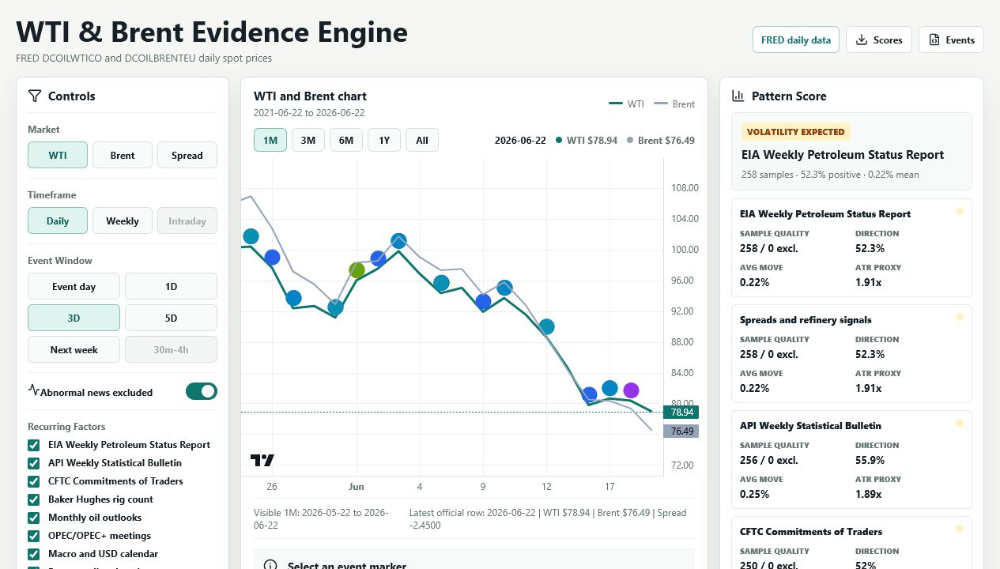
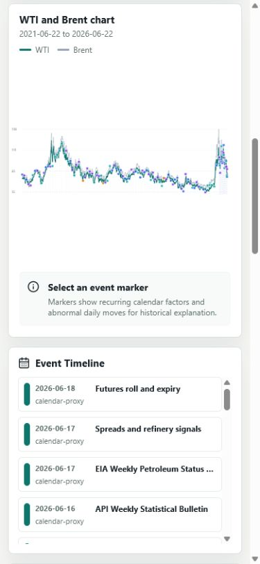

# WTI & Brent Evidence Engine

A React/Vite dashboard for studying repeatable fundamental patterns in WTI, Brent, and the Brent-WTI spread.

The app is built for oil traders who want to put fundamental release behavior on top of their own technical setup. It does not generate trade signals by itself. It helps answer a narrower research question:

> When a recurring oil-market report or factor becomes public, how did WTI and Brent respond across consistent daily windows, and was that response based on real direct surprise evidence or only calendar timing?

The most important design choice in this project is provenance. The UI is intentionally strict about separating:

- **Direct surprise evidence**: actual-vs-expected report data loaded from official/imported/user data.
- **Calendar proxy evidence**: recurring public release timing without actual report surprise values.
- **Abnormal news annotations**: large candles that may explain history but should not be treated as repeatable pattern evidence by default.

This matters because the dashboard may be used around real money decisions. The current bundled dataset is suitable for research and workflow review, not standalone live execution.

## Current Repository Status

Repository: `KaranSingh-FF/oil-evidence-engine`

Default branch: `main`

App framework: React + TypeScript + Vite

Charting library: `lightweight-charts`

Current bundled price file:

- File: `public/data/prices.json`
- Source: FRED daily spot prices
- Series:
  - WTI: `DCOILWTICO`
  - Brent: `DCOILBRENTEU`
- Latest aligned price row: `2026-07-06`
- Latest aligned values in the committed file:
  - WTI: `69.60`
  - Brent: `69.56`
- Generated at: `2026-07-10T15:35:32.0093073Z`

Current direct fundamental status:

- `public/data/eia-weekly.json` is not committed.
- `public/data/eia-weekly-sample.json` is committed as a synthetic review-only fixture.
- The app therefore starts with **0 active direct report releases**.
- The all-report ledger starts as recurring calendar timing evidence, not true actual-vs-expected surprise evidence.

## Screenshots

The committed screenshots are under `outputs/`.





## What The Dashboard Shows

### 1. TradingView-Style Price Chart

The main chart uses `lightweight-charts` and renders WTI, Brent, or Brent-WTI spread depending on the selected market.

Supported visible ranges:

- 1 month
- 3 months
- 6 months
- 1 year
- All data

The chart marks recurring report/factor events and lets the user select individual events for event-study review.

Important limitation:

- Daily price data can show settlement-to-settlement behavior.
- It cannot prove the immediate 30 minute to 4 hour post-release reaction.
- Intraday scoring remains disabled until timestamped intraday candles are imported and aligned to release timestamps.

### 2. All Report Response Ledger

The ledger answers the user's core question:

> What was the report/factor, and how did Brent/WTI respond every time that report/factor came public?

For every recurring report/factor row, it displays:

- Date
- Release timing label
- Report/factor family
- Evidence source status
- Report read
- Report detail
- WTI 1D response
- WTI 3D response
- Brent 1D response
- Brent 3D response
- Price-response read-through

The ledger has a visible warning when rows are proxy-only:

- Proxy rows show market response after recurring public release windows.
- Proxy rows do not prove what the actual report surprise was.
- Proxy rows should not be used as tradable fundamental patterns until official or user-verified actual-vs-expected data is loaded.

The ledger also shows the latest response boundary. For example, with price data ending `2026-07-06`, the latest 3D response row is `2026-07-01`. A later report cannot be honestly scored until enough price observations exist after it.

### 3. Reaction Story Panel

The top story panel summarizes one selected or current factor in plain language:

- Fundamental signal
- WTI/Brent 3D market response
- Read-through

The goal is fast visual comprehension: a trader should quickly see whether a bullish/bearish/proxy report was followed by a positive, negative, confirmed, or faded response.

### 4. Pattern Score Panel

The score cards aggregate event-study statistics by report/factor family.

Each score includes:

- Sample size
- Direction hit rate
- Mean return
- Median return
- Average absolute move
- ATR proxy
- Max adverse return
- Direct evidence share
- Confidence score
- Strategy label

Strategy labels are descriptive research labels only:

- `confirm-long`
- `confirm-short`
- `volatility-expected`
- `avoid`
- `no-edge`

They are not orders, recommendations, or position-sizing instructions.

### 5. Event Study Panel

When a user selects a specific event, the event study panel shows:

- Multi-window price response
- Occurrence history for that factor
- Pattern statistics
- Direct fundamental components when loaded
- Saved abnormal-news annotations

The event study lets traders review whether a single candle or move was part of a repeatable structure or was probably driven by a non-repeatable event.

### 6. Data Quality Panel

The data quality panel is designed as a hard guardrail.

It displays:

- Price row count
- Latest price date
- Proxy event count
- Direct event count
- Manual event count
- Active fundamental records
- Review-only records
- Direct families
- Intraday candle count
- Abnormal event exclusions
- Weekday gaps
- Current regime filter

It also contains three critical checks:

1. **Trade-readiness gate**
   - Good only when official FRED prices are fresh, direct fundamentals are loaded, and no proxy rows are in scope.
   - Otherwise the dashboard explicitly remains research-only.

2. **Price freshness**
   - Good when the latest aligned WTI/Brent row is no more than 7 days old.
   - Warns when the local price file is stale.

3. **Proxy evidence warning**
   - Warns when calendar proxy rows are being used.
   - States that holiday-adjusted official release dates and actual-vs-expected values must be imported for production use.

### 7. Direct EIA Imports

The app supports importing direct EIA/fundamental CSV rows through the UI.

A direct import can upgrade EIA WPSR rows from proxy timing to direct/manual evidence when the basket has enough eligible non-sample metric rows.

The importer rejects invalid families, unknown EIA metric IDs, missing required numbers, and invalid provenance values.

### 8. Export Tools

The top bar supports exporting:

- Score CSV
- Event JSON
- Review workbook CSV

These exports are intended for external review, journaling, and manual validation.

## Fundamental Factor Coverage

The app currently models 13 recurring report/factor families plus abnormal news annotations.

| Family ID | Label | Current Evidence Mode | Notes |
|---|---|---|---|
| `eia-wpsr` | EIA Weekly Petroleum Status Report | Proxy unless direct EIA records are loaded | Wednesday `10:30 ET` baseline. Holiday exceptions require official import. |
| `api-wsb` | API Weekly Statistical Bulletin | Calendar proxy | Tuesday after U.S. close baseline. |
| `cftc-cot` | CFTC Commitments of Traders | Calendar proxy | Friday `15:30 ET` baseline. |
| `rig-count` | Baker Hughes rig count | Calendar proxy | Friday baseline. |
| `monthly-outlooks` | Monthly oil outlooks | Calendar proxy | Monthly public outlook window. |
| `opec-meetings` | OPEC/OPEC+ meetings | Calendar proxy | Scheduled meeting window. |
| `macro-usd` | Macro and USD calendar | Calendar proxy | Early-month U.S. macro/Fed proxy. |
| `roll-expiry` | Futures roll and expiry | Calendar proxy | Monthly roll window. |
| `spreads-refinery` | Spreads and refinery signals | Calendar proxy | EIA/refinery-timed proxy. |
| `seasonality` | Oil seasonality | Calendar proxy | Monthly seasonal tag. |
| `brent-physical` | Brent physical supply | Calendar proxy | Monthly physical-market watch. |
| `brent-dubai` | Brent-Dubai / Asia arb | Calendar proxy | Monthly arbitrage watch. |
| `shipping-risk` | Tanker and freight stress | Calendar proxy | Freight risk watch. |
| `abnormal-news` | Abnormal news annotation | News annotation | Generated from large daily moves and excluded from core stats by default. |

## Data Sources And Provenance

### Price Data

Bundled daily prices come from FRED:

- WTI: <https://fred.stlouisfed.org/series/DCOILWTICO>
- Brent: <https://fred.stlouisfed.org/series/DCOILBRENTEU>

The refresh script downloads FRED CSVs from:

```text
https://fred.stlouisfed.org/graph/fredgraph.csv?id=DCOILWTICO
https://fred.stlouisfed.org/graph/fredgraph.csv?id=DCOILBRENTEU
```

Then it:

1. Drops blank observations.
2. Aligns WTI and Brent on common dates.
3. Keeps the trailing five-year window from the latest common date.
4. Calculates Brent-WTI spread.
5. Writes `public/data/prices.json`.

### EIA Weekly Petroleum Status Report

Official EIA weekly report page:

<https://www.eia.gov/petroleum/supply/weekly/>

Official EIA release schedule:

<https://www.eia.gov/petroleum/supply/weekly/schedule.php>

The app can load `public/data/eia-weekly.json` when present. That file should contain real direct actual-vs-expected records. Without it, the app falls back to `public/data/eia-weekly-sample.json`, which is synthetic, review-only, and excluded from active scoring.

### Source Status Meanings

| Status | Meaning | Can It Be Used As Direct Fundamental Evidence? |
|---|---|---|
| `calendar-proxy` | Recurring timing marker only. | No |
| `direct` | Imported/official actual-vs-expected data. | Yes, if non-sample and not excluded |
| `manual` | User-supplied direct evidence. | Yes, if non-sample and not excluded |
| `news-annotation` | Explanatory large-candle note. | No, excluded from core stats by default |

### Evidence Provenance Meanings

| Provenance | Meaning |
|---|---|
| `official` | Official source data. |
| `imported` | Imported data from a user-controlled source. |
| `user` | User-created direct evidence. |
| `sample` | Demo/synthetic/review-only data. |
| `mixed` | Mixed evidence quality in a basket. |

Sample/demo/synthetic evidence is intentionally excluded from active direct scoring.

## EIA Direct Fundamentals Format

Use this CSV header for the UI import:

```csv
date,family,metricId,metric,actual,expected,unit,source,surpriseQuality,provenance,sourceKind,expectationMethod,publishedAt,note
```

Minimum useful EIA row example:

```csv
date,family,metricId,metric,actual,expected,unit,source,surpriseQuality,provenance,sourceKind,expectationMethod,publishedAt,note
2026-07-01,eia-wpsr,crude_stocks_change,Commercial crude stocks change,-3.2,0.4,mb,EIA WPSR official,official,official,official,Analyst consensus,2026-07-01T14:30:00.000Z,Official actual with consensus expectation
2026-07-01,eia-wpsr,gasoline_stocks_change,Gasoline stocks change,-1.1,0.6,mb,EIA WPSR official,official,official,official,Analyst consensus,2026-07-01T14:30:00.000Z,Official actual with consensus expectation
```

Required fields:

- `date`
- `family`
- `actual`
- `expected`
- `unit`
- `source`

Recommended fields:

- `metricId`
- `metric`
- `surpriseQuality`
- `provenance`
- `sourceKind`
- `expectationMethod`
- `publishedAt`
- `note`

The app calculates:

```text
surprise = actual - expected
```

If `metricId` is supplied, it must be one of the supported EIA metric IDs.

### Supported EIA Metric IDs

| Metric ID | Label | Unit | Bullish When | Basket Weight | Normalization Scale |
|---|---|---:|---|---:|---:|
| `crude_stocks_change` | Commercial crude stocks change | `mb` | Lower | `1.5` | `5` |
| `cushing_stocks_change` | Cushing crude stocks change | `mb` | Lower | `0.7` | `2` |
| `gasoline_stocks_change` | Gasoline stocks change | `mb` | Lower | `1.0` | `3` |
| `distillate_stocks_change` | Distillate stocks change | `mb` | Lower | `0.9` | `2` |
| `refinery_utilization_change` | Refinery utilization change | `pct` | Higher | `0.8` | `2` |
| `crude_production_change` | Crude production change | `kbd` | Lower | `0.7` | `200` |
| `net_imports_change` | Net imports change | `kbd` | Lower | `0.8` | `500` |
| `spr_stocks_change` | Strategic Petroleum Reserve stocks change | `mb` | Higher | `0.3` | `2` |
| `product_supplied_change` | Product supplied change | `kbd` | Higher | `1.0` | `500` |

### EIA Basket Logic

Direct EIA rows are normalized and grouped by date.

The basket:

1. Deduplicates rows by date and metric ID.
2. Prefers sourced non-sample rows over sample rows.
3. Excludes sample rows from active direct metric count.
4. Applies bullish direction by metric:
   - Lower stocks are generally bullish.
   - Higher demand/product supplied is generally bullish.
   - Higher refinery utilization is treated as bullish.
5. Produces a basket score and basket label:
   - `bullish`
   - `bearish`
   - `neutral`

For EIA calendar proxy replacement, the basket must contain at least two eligible non-sample metrics and must not be excluded from core stats.

## Intraday OHLCV Import Format

Use this CSV header:

```csv
timestamp,market,open,high,low,close,volume
```

Example:

```csv
timestamp,market,open,high,low,close,volume
2026-07-01T14:30:00.000Z,wti,69.10,69.80,68.90,69.55,12000
2026-07-01T14:30:00.000Z,brent,68.90,69.40,68.50,69.20,11000
```

Valid markets:

- `wti`
- `brent`
- `spread`

Intraday import is currently loaded and counted, but 30m-4h scoring remains guarded until the release timestamp alignment workflow is completed.

## Scoring Methodology

The scoring engine is in `src/lib/scoring.ts`.

For each selected factor family, market, and window:

1. Events are deduplicated by `date + family`.
2. Direct evidence replaces proxy evidence where available.
3. Abnormal events are excluded when the abnormal filter is on.
4. Price returns are calculated for the selected window.
5. ATR proxy is calculated from recent absolute daily returns.
6. Statistics are computed:
   - Sample size
   - Direct evidence share
   - Mean return
   - Median return
   - Positive hit rate
   - Average absolute return
   - ATR multiple
   - Max adverse return
   - Abnormal share
   - Recency bias

Confidence score combines:

- Sample size component
- Directional skew component
- Volatility component
- Abnormal-event penalty

Important:

- A large sample size of proxy rows can make a factor useful for research.
- It does not make the factor direct fundamental evidence.
- Always check direct evidence share before treating a pattern as fundamental.

## Return Windows

Supported daily windows:

- `event-day`
- `1d`
- `3d`
- `5d`
- `next-week`

Implementation detail:

- `event-day` uses the same daily row as start and end. It is useful for event-study structure but not a true intraday post-release reaction.
- `1d`, `3d`, and `5d` use trading-row offsets.
- `next-week` targets seven calendar days later and uses the next available trading row.
- `intraday-30m-4h` is intentionally disabled until timestamp-aligned intraday candles are available.

## Regime Filters

The app supports regime filtering:

- `all`
- `high-volatility`
- `low-volatility`
- `wti-uptrend`
- `wti-downtrend`
- `spread-wide`
- `spread-tight`

Regime profiles are derived from daily price behavior, trend distance, and spread z-score in `src/lib/regimes.ts`.

## Abnormal Movement Handling

The app flags abnormal candles when either WTI or Brent has a large daily move. The current default threshold is `4%`.

Abnormal rows:

- Are marked as `abnormal-news`.
- Are excluded from core stats by default.
- Can be manually annotated in the app.
- Are intended for historical explanation, not repeatable strategy evidence.

Example use:

If a candle exists because of war headlines, OPEC surprise communication, sanctions, or an accident, the trader can annotate it. The app can then preserve the historical explanation while keeping that event out of repeatable pattern scoring.

## Development Setup

### Requirements

- Node.js
- pnpm
- PowerShell on Windows for the bundled FRED refresh script
- Git

### Install

```powershell
pnpm install
```

### Run Locally

```powershell
pnpm dev
```

The app runs at:

```text
http://127.0.0.1:5173/
```

### Refresh FRED Price Data

```powershell
pnpm fetch:data
```

The script:

- Downloads official FRED CSV data.
- Uses `Invoke-WebRequest` first.
- Falls back to `curl.exe` if PowerShell networking times out.
- Writes `public/data/prices.json`.

### Run Tests

```powershell
pnpm test
```

### Build

```powershell
pnpm build
```

The build command runs:

```text
tsc -b && vite build
```

## Repository Structure

```text
.
|-- docs/
|   `-- superpowers/
|       |-- plans/
|       `-- specs/
|-- outputs/
|   |-- oil-dashboard-desktop.png
|   |-- oil-dashboard-tradingview-desktop.png
|   `-- oil-dashboard-mobile-chart.png
|-- public/
|   `-- data/
|       |-- prices.json
|       `-- eia-weekly-sample.json
|-- scripts/
|   `-- fetch-fred-prices.ps1
|-- src/
|   |-- components/
|   |-- data/
|   |-- lib/
|   |-- App.tsx
|   |-- main.tsx
|   `-- styles.css
|-- package.json
|-- pnpm-lock.yaml
|-- tsconfig.json
|-- vite.config.ts
`-- README.md
```

## Important Files

| File | Purpose |
|---|---|
| `src/App.tsx` | Main app composition, data loading, filters, state, and exports. |
| `src/components/EvidenceChart.tsx` | TradingView-style WTI/Brent/spread chart and markers. |
| `src/components/EiaReportResponsePanel.tsx` | All-report response ledger. |
| `src/components/DataQualityPanel.tsx` | Trade-readiness, freshness, and provenance guardrails. |
| `src/components/ReactionStoryPanel.tsx` | Fast report-to-market-response summary. |
| `src/components/EventStudyPanel.tsx` | Selected event study and annotations. |
| `src/components/ImportPanel.tsx` | CSV import UI for fundamentals and intraday candles. |
| `src/lib/events.ts` | Recurring event calendar, abnormal event detection, and direct/proxy merge logic. |
| `src/lib/fundamentals.ts` | EIA normalization and surprise basket construction. |
| `src/lib/scoring.ts` | Pattern scoring engine. |
| `src/lib/reportResponses.ts` | Ledger row construction and WTI/Brent response calculations. |
| `src/lib/imports.ts` | CSV parsers and import summary logic. |
| `src/lib/eiaMetrics.ts` | Supported EIA metric definitions and weights. |
| `public/data/prices.json` | Bundled FRED WTI/Brent daily dataset. |
| `scripts/fetch-fred-prices.ps1` | Official FRED refresh script. |

## Production Readiness Checklist

Before using this dashboard in a live institutional workflow, complete this checklist.

### Data Freshness

- Run `pnpm fetch:data`.
- Confirm `public/data/prices.json` has a recent `latestDate`.
- Confirm the app's Data Quality panel shows price freshness as good.
- Confirm FRED has published both WTI and Brent observations for the latest row.

### Official Release Dates

- Load holiday-adjusted official EIA WPSR release dates.
- Do not rely only on naive Wednesday timing during holiday weeks.
- Validate API, CFTC, rig count, OPEC, macro, and monthly report release dates if those families are used for trading.

### Direct Fundamentals

- Add `public/data/eia-weekly.json` or import a fundamentals CSV.
- Use non-sample provenance:
  - `official`
  - `imported`
  - `user`
- Confirm active direct record count is greater than zero.
- Confirm direct families include the reports being traded.
- Confirm the all-report ledger is not purely proxy timing.

### Intraday Response

- Import timestamped WTI/Brent intraday OHLCV.
- Align candles to exact public release timestamps.
- Enable and validate 30m-4h scoring only after timestamp alignment is tested.

### News Controls

- Review abnormal movement flags.
- Add manual news annotations for known one-off events.
- Keep abnormal events excluded from core repeatable-pattern stats unless intentionally reviewing them.

### Statistical Review

- Check sample size.
- Check direct evidence share.
- Check max adverse return.
- Compare WTI and Brent separately.
- Validate whether Brent response is structurally different from WTI response.
- Review outliers before accepting a pattern.

## Known Limitations

1. The bundled state has no active direct EIA file.
   - The app starts as proxy timing research until direct actual-vs-expected data is loaded.

2. Calendar proxies are not report surprises.
   - They are only release-window markers.

3. Daily bars cannot prove immediate post-release behavior.
   - Use intraday candles for 30m-4h analysis.

4. News shocks are not predictable recurring factors.
   - The app flags large moves, but users must annotate the actual cause.

5. Some recurring factor dates are heuristic.
   - OPEC meetings, monthly outlooks, physical market windows, and roll windows require more official schedule data for production use.

6. The dashboard is a research tool.
   - It is not a broker, execution engine, signal service, risk model, or investment recommendation system.

## Recommended Trader Workflow

1. Refresh FRED price data.
2. Import official direct report surprise data.
3. Confirm Data Quality is not warning about stale prices or proxy-only evidence.
4. Select market:
   - WTI
   - Brent
   - Spread
5. Select window:
   - 1D for next-session reaction
   - 3D for follow-through
   - 5D or next-week for slower positioning effects
6. Review the all-report ledger.
7. Filter by report family.
8. Open event study for specific occurrences.
9. Annotate abnormal candles.
10. Export review CSV.
11. Compare the fundamental read with your own technical strategy.

## Validation Performed For The Current Commit

The previous code push was verified with:

```powershell
pnpm test
pnpm build
```

At that point:

- 15 test files passed.
- 79 tests passed.
- TypeScript build passed.
- Vite production build passed.
- Browser smoke check confirmed:
  - all-report ledger visible,
  - proxy warning visible,
  - price freshness good for `2026-07-06`,
  - research-only gate visible because direct report rows were still `0`.

Run the commands again after any data, code, or dependency change.

## License

No license file is currently provided. Treat the repository as private/internal unless a license is added.

## Disclaimer

This project is for research, review, and trader decision support. It does not provide financial advice, trade recommendations, execution instructions, portfolio allocation, or risk limits. Any production trading use requires independent source validation, operational controls, risk review, and human approval.
